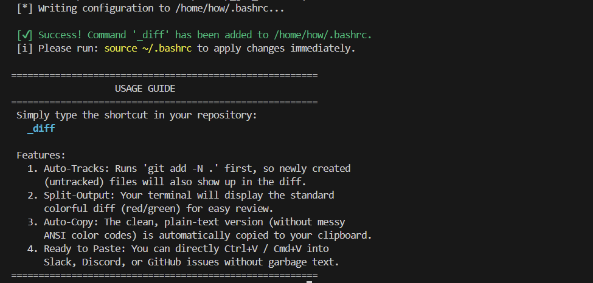

<div align="center">

# env-scripts

**適用於 Ubuntu 與 ROS 2 開發者的環境設定腳本：快速完成常用設定，也保留清楚的驗證與移除方式。**

[](./LICENSE)

</div>

> 適用於 Ubuntu。多數腳本會安裝系統套件、下載設定，或修改你的 `~/.bashrc`、`~/.tmux.conf` 與桌面設定；執行前請先閱讀對應腳本內容，並確認你信任來源。

## 為什麼使用它？

- **少做重複設定**：以單一腳本完成 RTW、tmux、Git diff 與 GNOME Dock 常用配置。
- **了解會改什麼**：每個流程說明安裝的套件、修改的位置與可能覆寫的設定檔。
- **能回復設定**：RTW 提供互動式移除腳本；會修改現有檔案的流程會在章節中明確標示。

## 選擇你要完成的事

| 目標 | 使用腳本 | 完成後得到什麼 |
| --- | --- | --- |
| 建立 ROS 2 團隊工作環境 | [安裝 RosTeamWorkspace](#安裝-rosteamworkspace-rtw) | RTW shell workflow 與 ROS workspace 指令 |
| 快速分享 Git 變更 | [設定 `_diff`](#設定-git-diff-剪貼簿快捷鍵) | 彩色 diff 顯示與純文字剪貼簿內容 |
| 建立 tmux 開發環境 | [設定 tmux](#設定-tmux) | 常用 pane/window 快捷鍵與滑鼠支援 |
| 在 GNOME Dock 放上顯示桌面按鈕 | [安裝顯示桌面啟動器](#安裝顯示桌面啟動器) | 一鍵切換顯示桌面 |

## 快速開始

執行前請確認：

- 使用 Ubuntu，且可執行 `sudo`。
- 已連上網路；腳本可能透過 `apt`、GitHub 或 Gist 下載內容。
- 關閉或備份正在編輯的 shell / tmux 設定檔。

建議先 clone 專案、檢查腳本後再執行：

```bash
git clone https://github.com/HowardWhile/env-scripts.git
cd env-scripts
sed -n '1,240p' install_ros_team_workspace.sh
bash install_ros_team_workspace.sh
```

若你偏好單行安裝指令，各章節也提供 `wget | bash` 版本；它會直接執行遠端內容，請只在確認來源與 branch 後使用。

## 安裝 RosTeamWorkspace (RTW)

為 ROS 2 團隊專案建立一致的 shell workflow。腳本會將 [b-robotized/ros_team_workspace](https://github.com/b-robotized/ros_team_workspace) 安裝到 `~/workspaces/ros_team_workspace`，並設定 `~/.ros_team_ws_rc` 與 `~/.bashrc` 自動載入 RTW 工具。

### 前置條件

- Ubuntu 24.04 以上為主要支援目標；較舊版本會盡力運作。
- 可使用 `sudo` 安裝缺少的 `git` 套件。
- 安裝時會詢問是否啟用 RTW terminal coloring，預設為不啟用。

### 安裝

```bash
wget -qO- https://raw.githubusercontent.com/HowardWhile/env-scripts/refs/heads/develop/install_ros_team_workspace.sh | bash
```

### 驗證：建立並啟用第一個 workspace

```bash
source ~/.bashrc
setup-ros-workspace ~/workspaces/ros/ws_ros jazzy
```

重新開啟 terminal 後，啟用 workspace 並使用常見指令：

```bash
_ws_ros
rosdepi
rosd
cb
```

### 安裝結果與設定

- 請保留 `~/workspaces/ros_team_workspace`；shell 設定會 source 其中的檔案。
- 腳本會將目前的 `ROS_DOMAIN_ID` 寫入 `~/.ros_team_ws_rc`；若未設定則使用 `0`。日後可直接修改該檔案。
- 預設 `ROS_STATIC_PEERS` 會被註解，避免固定 IP 設定不符合目前網路。
- 若 `~/.ros_team_ws_rc` 已存在，腳本會先建立帶時間戳記的備份。

| 指令 | 用途 | 對應動作 |
| --- | --- | --- |
| `_ws_ros` | 啟用 `ws_ros` workspace | `source ~/workspaces/ros/ws_ros/install/setup.bash` |
| `rosdepi` | 安裝 workspace `src` 內缺少的 rosdep 相依套件 | `rosdep install -r -y -i --from-paths "$ROS_WS/src"` |
| `rosd` | 進入目前 workspace 的 `src` 目錄 | `cd "$ROS_WS"` |
| `cb` | 建置目前 workspace | `colcon build --symlink-install --cmake-args -DCMAKE_BUILD_TYPE=RelWithDebInfo -DCMAKE_EXPORT_COMPILE_COMMANDS=ON` |

### 移除 RTW

移除流程會詢問是否刪除 RTW 設定、Python 套件、clone 與 CLI 設定，並先備份檔案。它不會移除你在其他位置建立的 ROS workspaces。

```bash
wget -qO- https://raw.githubusercontent.com/HowardWhile/env-scripts/refs/heads/develop/uninstall_ros_team_workspace.sh | bash
```

## 設定 Git diff 剪貼簿快捷鍵

建立 `_diff` shell function，讓你在 Git repository 內一次完成以下工作：

- 將包含未追蹤檔案的差異顯示在 terminal。
- 將不含 ANSI 色碼的純文字 diff 複製到剪貼簿，方便貼到 Slack、Discord 或 GitHub Issue。

腳本會在缺少時安裝 `xclip`，並寫入 `~/.bashrc`。若已偵測到 `_diff` 設定，會先詢問是否覆寫。

```bash
wget -qO- https://raw.githubusercontent.com/HowardWhile/env-scripts/refs/heads/develop/setup_git_diff.sh | bash
source ~/.bashrc
```

在任一 Git repository 中執行：

```bash
_diff
```



## 設定 tmux

安裝 `tmux` 與 `xclip`，並從指定 Gist 下載設定到 `~/.tmux.conf`。若 tmux 已在執行，設定會自動重新載入。

> 此腳本會覆寫既有 `~/.tmux.conf`。若你有自訂設定，請先備份。

```bash
wget -qO- https://raw.githubusercontent.com/HowardWhile/env-scripts/refs/heads/develop/setup_tmux_ubuntu.sh | bash
```

完成後，設定提供：

- 滑鼠模式與反白複製。
- <kbd>Alt</kbd> + 方向鍵切換 pane，<kbd>Shift</kbd> + 方向鍵切換 window。
- prefix 改為 <kbd>Ctrl</kbd> + <kbd>a</kbd>。
- <kbd>Ctrl</kbd> + <kbd>a</kbd>，再按 <kbd>|</kbd> 垂直切割；再按 <kbd>-</kbd> 水平切割。


## 安裝顯示桌面啟動器

在 GNOME 桌面安裝並釘選「Show Desktop」啟動器；點擊後可在顯示桌面與還原視窗間切換。

腳本會在缺少時安裝 `wmctrl`，建立 `~/.local/share/applications/show-desktop.desktop`，並更新 GNOME Dock 的我的最愛清單。

```bash
wget -qO- https://raw.githubusercontent.com/HowardWhile/env-scripts/refs/heads/develop/install_show_desktop.sh | bash
```


## 貢獻與回報問題

歡迎以 Issue 回報問題或提出改善建議。回報時請附上 Ubuntu 版本、使用的腳本名稱與完整錯誤輸出；提交 Pull Request 前，請先執行：

```bash
bash -n *.sh
git diff --check
```

## 授權

本專案以 [MIT License](./LICENSE) 授權。
