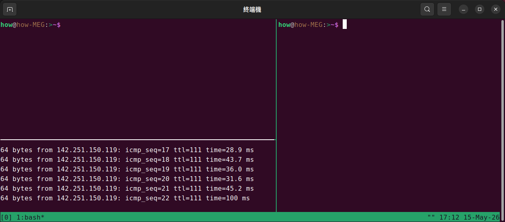
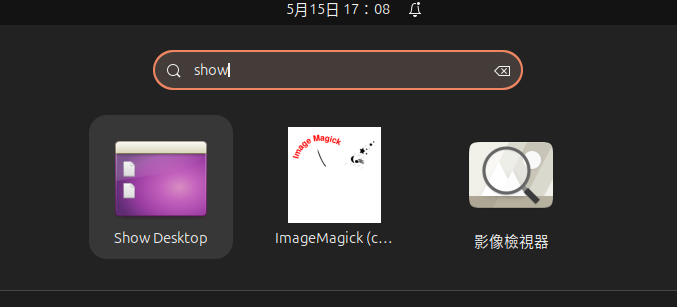

# env-scripts
我的環境腳本

## **setup_tmux_ubuntu.sh**

此腳本將更新套件庫、安裝 tmux 和 xclip、下載指定 Gist 中的 tmux 配置，並在 tmux 運行時重新載入配置。

```bash
wget -qO- https://raw.githubusercontent.com/HowardWhile/env-scripts/refs/heads/develop/setup_tmux_ubuntu.sh | bash
```




## **install_show_desktop.sh**

此腳本將安裝必要的 wmctrl 套件，並建立一個 "顯示桌面" 的桌面啟動器，讓您可以快速顯示桌面。

```bash
wget -qO- https://raw.githubusercontent.com/HowardWhile/env-scripts/refs/heads/develop/install_show_desktop.sh | bash
```




